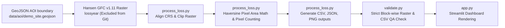

# Forest Change Monitor

A reproducible geospatial workflow for quantifying satellite-detected tree-cover loss inside a defined Area of Interest (AOI).

The project processes Hansen Global Forest Change `lossyear` raster data, clips it to a GeoJSON boundary, calculates annual tree-cover-loss area in hectares, runs automated quality-assurance checks, and presents precomputed results in a Streamlit dashboard.

> **Disclaimer:** This is a geospatial engineering demonstration. It reports satellite-detected tree-cover loss and does not independently confirm deforestation, estimate carbon stocks or CO₂e, or make a certification decision.

### 🌍 URLs
- **Live App**: [https://gaurav-619-forest-change-monitor-app-j9buxp.streamlit.app/](https://gaurav-619-forest-change-monitor-app-j9buxp.streamlit.app/) - Interactive dashboard displaying the precomputed analysis outputs.
- **Repository**: [https://github.com/gaurav-619/forest-change-monitor](https://github.com/gaurav-619/forest-change-monitor) - Source code, spatial methodologies, QA validations, and reproducibility instructions.

---

## 🎯 Why This Matters

Nature-based carbon and conservation projects need reliable spatial evidence to understand change within a defined project area. Raw satellite datasets are large and technically complex; decision-makers need transparent, repeatable, and reviewable outputs.

This project demonstrates a foundational monitoring workflow:

1. Define the area to analyse.
2. Extract the relevant satellite-derived change data.
3. Quantify annual tree-cover loss in hectares.
4. Validate that exported metrics match the spatial analysis.
5. Deliver results in a clear dashboard and reusable output files.

It answers: **where did satellite-detected tree-cover loss occur within this boundary, in which year, and over how much area?**

## 🏗️ Architecture & Data Flow



## ⚙️ Analysis Workflow

1. **Load AOI**: Reads and validates a user-defined GeoJSON boundary polygon.
2. **Align CRS**: Safely reprojects the vector boundary to match the `EPSG:4326` geographic coordinate system of the raw raster (protecting raster pixel integrity).
3. **Mask & Clip**: Uses Rasterio to extract the Hansen Global Forest Change pixels that fall inside the AOI polygon, assigning NoData to pixels outside it.
4. **Latitude-Adjusted Pixel Sizing**: Reads the raster affine transform and uses the AOI centroid latitude to estimate a latitude-adjusted pixel area in square metres, avoiding the incorrect assumption that every geographic pixel is exactly 30 m × 30 m.
5. **Count & Convert**: Efficiently scans the clipped NumPy array to count pixels matching encoded loss years (e.g., 2021 = 21), and converts counts to hectares using the local pixel size.
6. **Generate Outputs**: Writes a clean CSV of results, a QA metadata JSON file, and a visualization PNG map.
7. **Quality Assurance Validation**: Independently recalculates pixel counts from the clipped raster and checks that exported CSV counts and hectare values match within a defined rounding tolerance.

## 🚀 What This Demonstrates

As a **Geodata Analyst** portfolio piece, this repository highlights:
- **Geospatial Workflow Execution**: Managing coordinate reference systems, AOI boundaries, raster masking, and clipping without modifying the original source raster.
- **Satellite-Derived Raster Processing**: Reading, masking, and analysing GeoTIFF raster data with Rasterio and NumPy, while limiting the primary analysis to the clipped AOI.
- **Reproducible Metrics**: Deriving pixel area from raster metadata and a latitude-adjusted calculation rather than assuming every pixel is exactly 30 m × 30 m.
- **QA & Data Validation**: Building strict, automated cross-checks to ensure pipeline integrity.
- **Scalable Pipeline Design**: Separating the heavy back-end processing layer (`process_loss.py`) from the front-end dashboard (`app.py`).

## 📊 Results Summary (Prey Lang AOI)

The pipeline processed an illustrative ~12,000-hectare boundary in Cambodia and generated the following **satellite-detected tree-cover loss estimates**:

| Year | Loss Pixels | Computed Area (Hectares) |
|---|---|---|
| **2021** | 26,159 | 1,960.29 ha |
| **2022** | 5,122 | 383.83 ha |
| **2023** | 1,543 | 115.63 ha |

## ✅ Quality Assurance

The pipeline includes automated checks designed to make the final outputs traceable and reproducible.

**Current status: PASS**

- **Dataset lineage:** Records the Hansen Global Forest Change dataset version used by the analysis.
- **AOI validation:** Confirms that the GeoJSON contains a valid analysis boundary and that it falls within raster coverage.
- **CRS handling:** Aligns the AOI to the raster coordinate reference system before clipping.
- **Year-Encoding Check:** Explicitly verifies that the requested encoded loss-year values (21, 22, and 23) are present in the relevant analysed data.
- **Independent CSV Cross-Check:** Re-opens the clipped output raster and independently recalculates pixel counts, confirming that the CSV and dashboard metrics match the generated spatial output.
- **Area validation:** Confirms hectare values equal pixel count multiplied by the calculated pixel area, within a defined rounding tolerance.

These checks validate the pipeline output; they do not independently verify the real-world cause of observed tree-cover loss.

*For full details on the QA process and Methodology, see [docs/qa.md](docs/qa.md) and [docs/methodology.md](docs/methodology.md).*

---

## ⚠️ Limitations & Disclaimer

This project is a geospatial engineering demonstration and is **not a certification decision or carbon-accounting tool**. 
- It detects **tree-cover loss** (canopy disturbance), not verified anthropogenic deforestation.
- It does **not** calculate above-ground biomass, carbon stock, or CO₂e.
- The AOI is an illustrative bounding box, not a legally surveyed conservation boundary.

*For full limitations, see [docs/limitations.md](docs/limitations.md).*

---

## 💻 Local Setup & Run Instructions

### 1. Environment Setup
```bash
# Clone the repository
git clone https://github.com/<your-username>/forest-change-monitor.git
cd forest-change-monitor

# Create and activate a virtual environment
python -m venv .venv
source .venv/bin/activate  # On Windows use: .venv\Scripts\activate

# Install dependencies
pip install --upgrade pip
pip install -r requirements.txt
```

### 2. Run Automated Tests
```bash
# Run the Pytest suite to verify core math and logic
pytest tests/
```

### 3. Run Pipeline Locally (Optional)
By default, the dashboard uses precomputed results stored in `outputs/`. To run the heavy pipeline yourself:
```bash
# Download the raw Hansen raster tile (Mac/Linux)
mkdir -p data/raw
curl -L -o data/raw/Hansen_GFC-2023-v1.11_lossyear_20N_100E.tif "https://storage.googleapis.com/earthenginepartners-hansen/GFC-2023-v1.11/Hansen_GFC-2023-v1.11_lossyear_20N_100E.tif"

# Remove precomputed outputs (Mac/Linux)
rm -rf outputs/*
```

```powershell
# Download the raw Hansen raster tile (Windows PowerShell)
New-Item -ItemType Directory -Force -Path data\raw
Invoke-WebRequest -Uri "https://storage.googleapis.com/earthenginepartners-hansen/GFC-2023-v1.11/Hansen_GFC-2023-v1.11_lossyear_20N_100E.tif" -OutFile "data\raw\Hansen_GFC-2023-v1.11_lossyear_20N_100E.tif"

# Remove precomputed outputs (Windows PowerShell)
Remove-Item -Path outputs\* -Recurse -Force
```

```bash
# Run the pipeline
python scripts/run_pipeline.py

# Run the validation check
python validate.py
```

### 4. Start the Dashboard
```bash
streamlit run app.py
```

---

## ☁️ Streamlit Community Cloud Deployment

This app is optimized for seamless deployment on Streamlit Community Cloud without requiring the original Hansen GeoTIFF.
1. Connect your GitHub repository to Streamlit Cloud.
2. Select `app.py` as the main file.
3. The app will automatically detect the absence of the raw raster, skip the heavy processing phase, and load the dashboard using precomputed outputs from the `outputs/` directory. 

---

## 🛣️ Next Improvements Roadmap
- **Batch Processing**: Extend the pipeline to accept folders containing multiple `.geojson` AOIs.
- **Formal Export**: Generate a templated, print-ready PDF report containing the results and QA metadata.
- **Workflow Automation**: Tie into Google Earth Engine (GEE) APIs to dynamically fetch composites for independent verification imagery.
