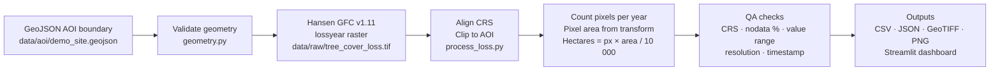

# forest-change-monitor

A geospatial data-engineering portfolio project that processes satellite-derived
annual tree-cover-loss data inside a defined boundary, quantifies mapped area by
year, runs automated QA checks, and presents the results in a Streamlit
dashboard — demonstrating the spatial-screening layer of a forest-carbon MRV
workflow without claiming to perform carbon accounting or certification.

---

## Screenshot

*(Add a screenshot of the running app here once the raster is downloaded.)*

---

## Architecture



---

## Why this relates to Equitable Earth

Equitable Earth's certification process covers the full MRV stack: surveyed
project boundaries, pixel-level above-ground biomass modelling, jurisdiction-
level baselines, Monte Carlo uncertainty, and independent third-party
verification.

This project reproduces **one step of that stack** — the spatial processing
layer that asks *where did tree-cover change occur, how much area, and in which
year?* — in a transparent, reproducible, and testable way.

| Real certification stage | What this project implements | Intentionally out of scope |
|---|---|---|
| Surveyed project boundary | Illustrative GeoJSON polygon | Formal survey, legal boundary |
| Satellite-derived loss detection | Hansen GFC lossyear raster clip + pixel count | Sentinel-2 / GEE composites (Phase 2) |
| Per-pixel above-ground biomass | — | AGB modelling |
| Carbon stock change | — | AGB → carbon → CO₂e |
| Uncertainty quantification | — | Monte Carlo bounds |
| Additionality / baselines | — | Jurisdiction-level reference levels |
| Verification | Automated QA checks | Independent third-party audit |

This is not an Equitable Earth product and claims no affiliation with them.

---

## Installation

```bash
git clone https://github.com/<your-handle>/forest-change-monitor.git
cd forest-change-monitor

python -m venv .venv
# Mac / Linux:
source .venv/bin/activate
# Windows:
.venv\Scripts\activate

pip install -e ".[dev]"
```

---

## Data setup (required before first run)

The processing pipeline expects the Hansen GFC v1.11 lossyear raster at:

```
data/raw/tree_cover_loss.tif
```

This file is ~600 MB and is not committed to Git. See [`data/README.md`](data/README.md)
for step-by-step download instructions (no login or credentials required).

Short version:

```bash
mkdir -p data/raw
curl -L -o data/raw/tree_cover_loss.tif \
  "https://storage.googleapis.com/earthenginepartners-hansen/GFC-2023-v1.11/Hansen_GFC-2023-v1.11_lossyear_20N_100E.tif"
```

---

## Running the processing pipeline

The app processes the raster automatically on first load. To run it manually:

```python
from forest_change.process_loss import run_full_pipeline

run_full_pipeline(
    aoi_path="data/aoi/demo_site.geojson",
    lossyear_path="data/raw/tree_cover_loss.tif",
    output_dir="outputs/",
    years=(2021, 2022, 2023),
    utm_epsg=32648,
)
```

Outputs written to `outputs/`:
- `yearly_loss_summary.csv`
- `yearly_loss_summary.json` (includes QA metadata)
- `clipped_lossyear.tif`
- `loss_map.png`

---

## Running tests

```bash
pytest -q
```

Expected output: all tests pass. Tests use small synthetic rasters built in
memory — no real data file required.

```
..................
18 passed in X.XXs
```

---

## Running the dashboard

```bash
streamlit run app.py
```

Open `http://localhost:8501` in your browser.

If the raster has not been downloaded yet, the app shows a clear setup
instruction panel. AOI information and methodology are displayed regardless.

---

## Deploying to Streamlit Community Cloud

1. Push this repository to GitHub (public repo).
2. Go to [share.streamlit.io](https://share.streamlit.io) and sign in with
   your GitHub account.
3. Click **New app** → select your repository → set:
   - **Main file path:** `app.py`
   - **Python version:** 3.12
4. Click **Deploy**.

> **Note:** The 600 MB raster cannot be stored in Git, so the deployed app
> will show the "Data setup required" panel by default. To show live results,
> either commit the pre-processed `outputs/yearly_loss_summary.csv` (6 rows,
> tiny) or use Streamlit Secrets + cloud storage (Phase 2 improvement).
>
> **Recommended for portfolio:** commit `outputs/yearly_loss_summary.csv` and
> `outputs/yearly_loss_summary.json` after running the pipeline locally.
> The app will load from those files without needing the raster on the server.

---

## Data provenance

| Item | Detail |
|---|---|
| Dataset | Hansen / UMD / Google / USGS / NASA Global Forest Change v1.11 |
| Variable | Annual tree-cover-loss year (lossyear) |
| Source tile | `Hansen_GFC-2023-v1.11_lossyear_20N_100E.tif` |
| Coverage | 10°N–20°N, 100°E–110°E (includes all of Cambodia) |
| Resolution | ~30 m (1 arc-second) |
| Temporal range | 2001–2023 |
| Pixel encoding | 0 = no loss; N = loss in year 2000+N; 255 = nodata |
| License | CC BY 4.0 |
| Citation | Hansen et al., Science 2013, doi:10.1126/science.1244693 |

---

## Limitations

- The AOI is illustrative — not a surveyed boundary.
- Tree-cover loss ≠ deforestation. Causes include logging, fire, agriculture, drought, and plantations.
- Cause of loss cannot be determined from this dataset alone.
- No biomass, carbon, or CO₂e is calculated.
- 30 m resolution may miss small clearing events and misclassify boundary pixels.
- Raw pixel counts are a screening estimate, not a statistically validated area.
- Results require contextual and field review before any operational use.
- Not an Equitable Earth product.

See [`docs/limitations.md`](docs/limitations.md) for the full discussion.

---

## Next version

**Phase 2** (planned once Google Earth Engine access is ready):
- Pull cloud-masked Sentinel-2 surface-reflectance composites via the GEE API.
- Compute NDVI before/after the periods in `config/demo_site.yaml`.
- Flag pixels where NDVI drops by more than a configurable threshold.
- Compare detected pixels against Hansen loss year as a cross-validation layer.

Phase 2 will still **not** compute biomass, carbon, CO₂e, or certification
outcomes. It extends the spatial screening capability with a second independent
signal; it does not advance the pipeline into carbon accounting.
