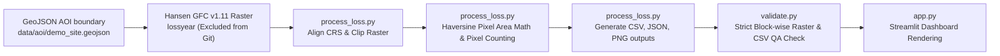

# Forest Change Monitor

A reproducible, automated spatial pipeline that processes satellite-derived tree-cover loss data inside a defined Area of Interest (AOI), executes strict QA checks, and presents precomputed results via a Streamlit dashboard. 

### 🌍 URLs
- **Live App**: [Streamlit Community Cloud Link Here] - Interactive dashboard displaying the precomputed analysis outputs.
- **Repository**: [GitHub Link Here] - Source code, spatial methodologies, QA validations, and reproducibility instructions.

---

## 🎯 Why This Matters

In the geospatial and carbon monitoring (MRV) domain, establishing ground truth starts with rigorous, reproducible spatial processing. This project models the foundational **geospatial screening layer** used to ask: *Where did tree-cover change occur, what is the mathematically accurate area of that change, and in what year did it happen?* By automating data masking, precision area calculation, and strict QA cross-validation, this repository demonstrates a founder-ready approach to transparent environmental data engineering.

## 🏗️ Architecture & Data Flow



## ⚙️ Analysis Workflow

1. **Load Data**: Ingests a user-defined `.geojson` boundary polygon.
2. **Align CRS**: Safely reprojects the vector boundary to match the `EPSG:4326` geographic coordinate system of the raw raster (protecting raster pixel integrity).
3. **Mask & Clip**: Uses `rasterio` to cookie-cutter the massive global dataset down to the specific AOI polygon, assigning `NoData` to exterior pixels.
4. **Precision Pixel Sizing**: Extracts the AOI's centroid latitude and applies the Haversine trigonometric formula to the raster's affine transform to compute a highly accurate, latitude-adjusted pixel area in square meters.
5. **Count & Convert**: Efficiently scans the clipped NumPy array to count pixels matching encoded loss years (e.g., 2021 = 21), and converts counts to hectares using the local pixel size.
6. **Generate Outputs**: Writes a clean CSV of results, a QA metadata JSON file, and a visualization PNG map.
7. **Strict QA Validation**: Runs a validation script to explicitly check that the generated CSV numbers perfectly match a fresh manual count of the physical `.tif` output.

## 🚀 What This Demonstrates

As a **Geodata Analyst** portfolio piece, this repository highlights:
- **Geospatial Workflow Execution**: Managing CRS, boundaries, and spatial joins without modifying raw pixel data.
- **Satellite-Derived Raster Processing**: Handling massive (109MB+) GeoTIFFs using memory-efficient block-window scanning (`rasterio`).
- **Reproducible Metrics**: Avoiding hardcoded constants (like assuming pixels are exactly 30m) in favor of dynamic mathematical derivations.
- **QA & Data Validation**: Building strict, automated cross-checks to ensure pipeline integrity.
- **Scalable Pipeline Design**: Separating the heavy back-end processing layer (`process_loss.py`) from the front-end dashboard (`app.py`).

## 📊 Results Summary (Prey Lang AOI)

The pipeline processed an illustrative ~12,000-hectare boundary in Cambodia and generated the following **satellite-mapped tree-cover loss estimates**:

| Year | Loss Pixels | Computed Area (Hectares) |
|---|---|---|
| **2021** | 26,159 | 1,960.29 ha |
| **2022** | 5,122 | 383.83 ha |
| **2023** | 1,543 | 115.63 ha |

## ✅ Quality Assurance (QA) Status

An automated validation suite (`validate.py`) strictly guards the integrity of the data. **Current Status: ALL PASSED**.
- **Data-Lineage**: Confirms the pipeline ran against the official Hansen GFC v1.11 dataset.
- **Spatial Coverage**: Confirms the provided AOI polygon sits entirely inside the source raster bounds.
- **Full-Raster Check**: Scans the raw raster in memory-efficient blocks to guarantee the dataset physically contains data up to the year 2023.
- **Strict CSV Cross-Check**: Manually re-opens the output raster and CSV, counting pixels line-by-line to guarantee the dashboard metrics perfectly match the generated spatial file.

*For full details on the QA process and Methodology, see [docs/qa.md](docs/qa.md) and [docs/methodology.md](docs/methodology.md).*

---

## ⚠️ Limitations & Disclaimer

This project is a geospatial engineering demonstration and is **not a certification decision or carbon-accounting tool**. 
- It detects **tree-cover loss** (canopy disturbance), not verified anthropogenic deforestation.
- It does **not** calculate above-ground biomass, carbon stock, or CO₂e.
- The AOI is an illustrative bounding box, not a legally surveyed conservation boundary.

*For full limitations, see [docs/limitations.md](docs/limitations.md).*

---

## 💻 Local Setup & Run Instructions

### 1. Environment Setup
```bash
# Clone the repository
git clone https://github.com/<your-username>/forest-change-monitor.git
cd forest-change-monitor

# Create and activate a virtual environment
python -m venv .venv
source .venv/bin/activate  # On Windows use: .venv\Scripts\activate

# Install dependencies
pip install --upgrade pip
pip install -r requirements.txt
```

### 2. Run Automated Tests
```bash
# Run the Pytest suite to verify core math and logic
pytest tests/
```

### 3. Run Pipeline Locally (Optional)
By default, the dashboard uses precomputed results stored in `outputs/`. To run the heavy pipeline yourself:
```bash
# Download the raw 109MB Hansen raster tile
mkdir -p data/raw
curl -L -o data/raw/Hansen_GFC-2023-v1.11_lossyear_20N_100E.tif "https://storage.googleapis.com/earthenginepartners-hansen/GFC-2023-v1.11/Hansen_GFC-2023-v1.11_lossyear_20N_100E.tif"

# Remove precomputed outputs
rm -rf outputs/*

# Run the pipeline
python scripts/run_pipeline.py

# Run the validation check
python validate.py
```

### 4. Start the Dashboard
```bash
streamlit run app.py
```

---

## ☁️ Streamlit Community Cloud Deployment

This app is optimized for seamless deployment on Streamlit Community Cloud without requiring the massive raw GeoTIFF.
1. Connect your GitHub repository to Streamlit Cloud.
2. Select `app.py` as the main file.
3. The app will automatically detect the absence of the raw raster, skip the heavy processing phase, and instantly load the beautiful dashboard using the precomputed `outputs/` directory. 

---

## 🛣️ Next Improvements Roadmap
- **Batch Processing**: Extend the pipeline to accept folders containing multiple `.geojson` AOIs.
- **Formal Export**: Generate a templated, print-ready PDF PDF report of the QA JSON.
- **Workflow Automation**: Tie into Google Earth Engine (GEE) APIs to dynamically fetch composites for independent verification imagery.
